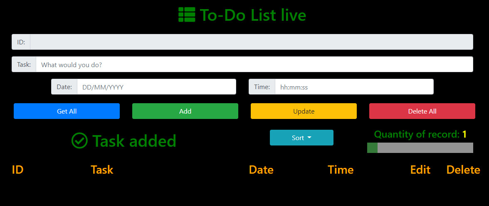

# indexedDB-Dexie.js
Using indexedDB with Dexie.js
Giao diện: 

ID là khóa chính/id của dữ liệu khi ghi dữ liệu được tạo ra khi ghi dữ liệu, không thể chỉnh được
Task: chuỗi, Date: "DD/MM/YYYY", Time: "hh:mm"

--------------------------------------------------------------------------------------------------

Khi trang được tải thì database và các objectStore cần thiết sẽ được tạo 

objectStore toDo là của người dùng - dùng để lưu dữ liệu, còn phần còn lại được tạo tự động bởi Dexie.Observable để đồng bộ dữ liệu
dữ liệu sẽ được lưu trong toDo. Time, task, date là các index được tạo để thuận tiện cho việc truy vấn dữ liệu - lây là cấu trúc 
chung khi dùng indexedDB

--------------------------------------------------------------------------------------------------
Các nút trên giao diện: 

Lần lượt các chức năng
    1) Add dùng ghi dữ liệu 
        dữ liệu sau khi được ghi sẽ xuất hiện phía dưới 
 
    2) Get All dùng lấy tất cả dữ liệu 
        dữ liệu sau khi được lấy sẽ xuất hiện phía dưới 

    3) Update dùng cập nhật dữ liệu 
        dữ liệu sau khi được cập nhật sẽ xuất hiện vào chỗ dữ liệu cũ, 
        để thực hiện chỉnh sửa dữ liệu ta nhấn vào nút edit màu vàng tương ứng để thông 
        tin hiện lên lại các ô input sau đó đổi dữ liệu và nhấn Update
 
    4) Delete All Xóa toàn bộ dữ liệu 
        dữ liệu sau khi xóa sẽ mất hết 